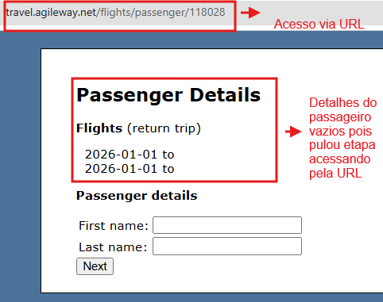

# BUG-BK-01: Acesso direto via URL à tela de Passenger Details sem seleção prévia de voo

**Status:** Aberto
**Severidade:** Alta
**Prioridade:** High
**Componente:** Booking
**Caso de teste vinculado:** [QA-BK05](../../test-cases/booking.md)
**Ciclo de execução:** Regressão — Full
**Ambiente:** travel.agileway.net (produção/demo pública)
**Reportado por:** Enzo Coelho
**Data:** 11/09/2026

---

## Resumo
O sistema permite acessar diretamente a tela de detalhes do passageiro via URL, sem exigir a seleção prévia de um voo, deixando a página carregar com os dados do voo e os campos de nome/sobrenome em branco.

## Pré-condição
1. Estar logado no sistema.
2. Não ter nenhum voo selecionado na tela de busca.

## Passos para reproduzir
1. Digitar ou colar diretamente na barra de endereços do navegador o link da página de passageiro com um número no final, por exemplo:
   `travel.agileway.net/flights/passenger/118028`
2. Pressionar Enter para carregar a página.

## Resultado esperado
O sistema deve bloquear o acesso, exibir um aviso informando que nenhum voo foi selecionado, e redirecionar o usuário de volta para a tela de busca/seleção de voos.

## Resultado obtido
O sistema abre a página normalmente, porém com a seção de detalhes do voo e os campos de nome e sobrenome do passageiro em branco — permitindo contornar o fluxo normal de compra.

## Evidência

## Impacto
O usuário consegue pular a etapa de escolher o voo e ainda assim chegar na tela de dados do passageiro, com tudo em branco. Isso é o mesmo problema do BUG-PAY-001 (acesso direto via URL sem completar as etapas antes).