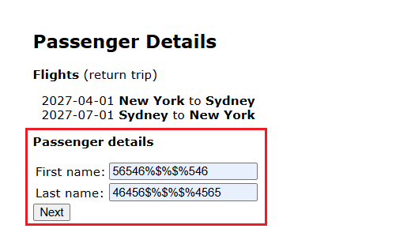

# BUG-BK-02: Campos de nome e sobrenome do passageiro aceitam números e caracteres especiais

**Status:** Aberto
**Severidade:** Média
**Prioridade:** Normal
**Componente:** Booking
**Caso de teste vinculado:** QA-BK03
**Ciclo de execução:** Regressão — Full
**Ambiente:** travel.agileway.net (produção/demo pública)
**Reportado por:** Enzo Coelho
**Data:** 11/09/2026

---

## Resumo
Os campos `First name` e `Last name` do passageiro aceitam qualquer coisa — número, símbolo, o que for — sem barrar nada.

## Pré-condição
1. Estar logado na aplicação.
2. Estar na página de Passenger Details, depois de já ter selecionado um voo válido.

## Passos para reproduzir
1. No campo `First name`, digitar algo com número e símbolo (ex: `56546%$$%%546`).
2. No campo `Last name`, digitar algo parecido (ex: `46456%$$%%4565`).
3. Ver o que acontece nos campos e tentar continuar clicando em `Next`.

## Resultado esperado
O sistema deveria bloquear número e caractere especial nesses campos, já que são pra nome de pessoa, e mostrar um alerta ao usuário para corrigir.

## Resultado obtido
O sistema aceita os campos preenchidos com números e símbolos sem nenhuma restrição, sem validar o formato.

## Evidência

## Impacto
Passageiro com nome inválido pode gerar problemas como em bilhete impresso, em check-in, em qualquer integração que dependa desse dado estar correto. É uma validação de campo que necessita de correção.