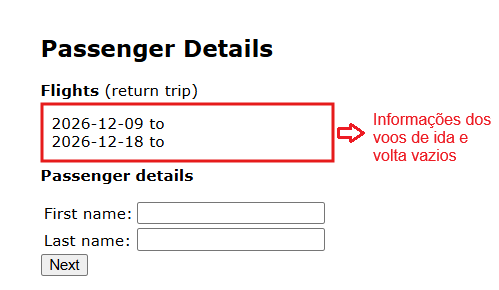

# BUG-FS-01: Sistema deixa avançar para o booking sem selecionar nenhum voo

**Status:** Aberto
**Severidade:** Alta
**Prioridade:** High
**Componente:** Flight-Search
**Caso de teste vinculado:** [QA-FS06](../../test-cases/flight-search.md)
**Ciclo de execução:** Regressão — Full
**Ambiente:** travel.agileway.net (produção/demo pública)
**Reportado por:** Enzo Coelho
**Data:** 11/09/2026

---

## Resumo
É possível avançar para a tela de preenchimento de passageiros sem selecionar nenhum voo na etapa anterior, resultando em campos de origem e destino vazios.

## Pré-condição
1. Estar logado na aplicação.
2. Estar na tela de seleção de voos (Select Flight), depois de preencher a busca.

## Passos para reproduzir
1. Chegar na tela onde os voos disponíveis são listados.
2. Não marcar nenhum checkbox de voo.
3. Clicar em `Continue` sem escolher nenhum voo.
4. Ver a tela seguinte (Passenger Details).

## Resultado esperado
O sistema deve validar se um voo foi selecionado antes de permitir a navegação, exibindo uma mensagem de bloqueio caso nenhum item esteja marcado.

## Resultado obtido
O fluxo avança normalmente para a etapa de dados do passageiro. A seção de voos é renderizada de forma incorreta (cortada) e os campos de origem e destino permanecem em branco ou com dados inconsistentes.

## Evidência

## Impacto
Este é o terceiro defeito consecutivo identificado com a mesma raiz (recorrente em BUG-PAY-001 e BUG-BK-001), evidenciando falhas de controle de fluxo entre etapas. Como o problema ocorre logo no início da jornada, há forte indício de que a ausência de validação de etapas pré-requisitas seja um padrão sistêmico em todo o fluxo de compra.