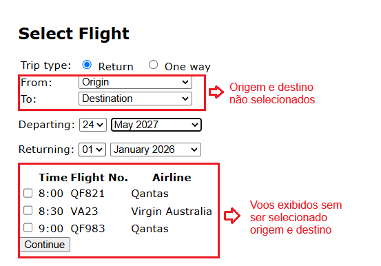

# BUG-FS-02: Sistema lista voos mesmo com origem e destino vazios

**Status:** Aberto
**Severidade:** Alta
**Prioridade:** Normal
**Componente:** Flight-Search
**Caso de teste vinculado:** QA-FS07
**Ciclo de execução:** Regressão — Full
**Ambiente:** travel.agileway.net (produção/demo pública)
**Reportado por:** Enzo Coelho
**Data:** 11/09/2026

---

## Resumo
Mesmo sem escolher a cidade de origem e destino, o sistema exibe a listagem de voos assim que a data é preenchida.

## Pré-condição
1. Estar logado na aplicação.
2. Estar na página de busca de voos.

## Passos para reproduzir
1. Deixar os campos `From` e `To` sem preencher (com os textos padrão `Origin` e `Destination`).
2. Preencher ou alterar os campos de data (`Departing` / `Returning`).
3. Observar o que aparece logo abaixo dos seletores de data.

## Resultado esperado
O sistema deveria validar se origem e destino foram preenchidos antes de liberar a busca, bloqueando a listagem de voos até que cidades válidas sejam escolhidas.

## Resultado obtido
Assim que a data de partida é alterada, o sistema ignora que `From` e `To` ainda estão vazios ou no valor padrão e já carrega a listagem de voos na tela.

## Evidência

## Impacto
A ausência de validação nos campos obrigatórios de origem e destino na tela de busca compromete a integridade dos resultados apresentados. Permitir a listagem de voos com base apenas na data pode induzir o usuário ao erro, gerando expectativas incorretas e corrompendo as etapas seguintes do fluxo caso o processo seja continuado a partir de uma busca incompleta.