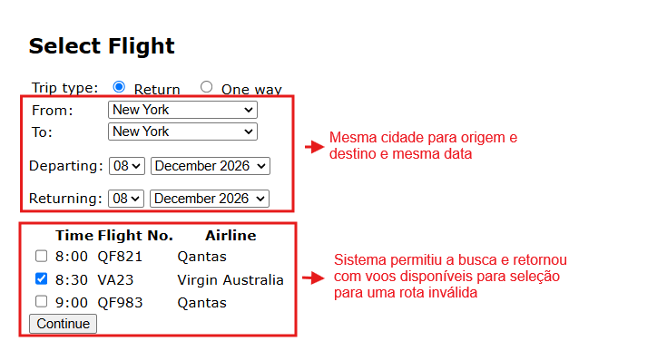

# BUG-FS-03: Sistema permite buscar e selecionar voo com mesma cidade em origem/destino e mesma data de ida e volta

**Status:** Aberto
**Severidade:** Alta
**Prioridade:** High
**Componente:** Flight-Search
**Caso de teste vinculado:** QA-FS12
**Ciclo de execução:** Regressão — High / Regressão — Full
**Ambiente:** travel.agileway.net (produção/demo pública)
**Reportado por:** Enzo Coelho
**Data:** 11/09/2026

---

## Resumo
É possível buscar passagens com a mesma cidade de origem e destino e datas idênticas de ida e volta, e o sistema exibe os voos normalmente e deixa seguir a compra.

## Pré-condição
1. Estar logado na aplicação.
2. Estar na página de busca de voos.

## Passos para reproduzir
1. Selecionar o tipo de viagem como "Return".
2. Preencher `From` e `To` com a mesma cidade (ex: `New York`).
3. Colocar a mesma data para partida e retorno (ex: `08 December 2026`).
4. Ver a listagem de voos gerada e marcar uma opção.
5. Clicar em Continue.

## Resultado esperado
O sistema deveria bloquear a busca quando origem e destino são iguais, principalmente com data de ida e volta idênticas, e mostrar uma mensagem de erro impedindo continuar.

## Resultado obtido
O sistema ignora a duplicidade de cidade e de data, mostra os horários disponíveis normalmente e deixa selecionar o voo e avançar no fluxo de compra.

## Evidência

## Impacto
Uma reserva com origem e destino iguais e datas idênticas gera registros inválidos que comprometem as etapas de pagamento e podem resultar em falhas de processamento, além de sobrecarregar o suporte com cancelamentos e reembolsos. Trata-se de uma falha na validação de regras de negócio essenciais.