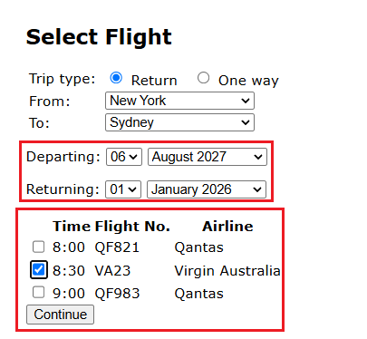

# BUG-FS-04: Sistema aceita data de retorno anterior à data de partida e mostra voos normalmente

**Status:** Aberto
**Severidade:** Alta
**Prioridade:** High
**Componente:** Flight-Search
**Caso de teste vinculado:** QA-FS09
**Ciclo de execução:** Regressão — High / Regressão — Full
**Ambiente:** travel.agileway.net (produção/demo pública)
**Reportado por:** Enzo Coelho
**Data:** 11/09/2026

---

## Resumo
O sistema permite selecionar uma data de retorno anterior à data de partida e prossegue com a busca, exibindo voos normalmente.

## Pré-condição
1. Estar logado na aplicação.
2. Estar na página de busca de voos.

## Passos para reproduzir
1. Selecionar o tipo de viagem como "Return".
2. Preencher origem e destino com cidades válidas (ex: `New York` para `Sydney`).
3. Colocar uma data de partida mais pra frente (ex: 06 August 2027).
4. Colocar uma data de retorno anterior à de partida (ex: 01 January 2026).
5. Observar o que aparece abaixo dos seletores de data.

## Resultado esperado
O sistema deveria validar que a data de retorno não pode vir antes da data de partida, mostrar um erro e não listar nenhum voo.

## Resultado obtido
O sistema aceita a combinação de datas sem sentido, processa a busca normalmente e mostra as opções de voo pra seleção.

## Evidência

## Impacto
Permitir datas de retorno anteriores à partida resulta em reservas inválidas caso o fluxo seja concluído. Trata-se de uma falha crítica na validação de regras de negócio.