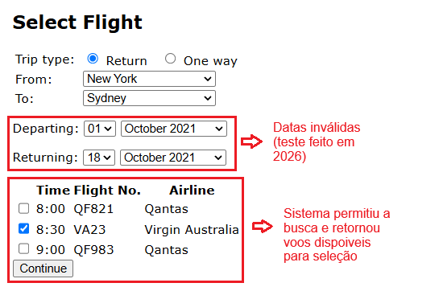

# BUG-FS-05: Sistema aceita data de partida no passado e mostra voos normalmente

**Status:** Aberto
**Severidade:** Alta
**Prioridade:** Normal
**Componente:** Flight-Search
**Caso de teste vinculado:** QA-FS13
**Ciclo de execução:** Regressão — Full
**Ambiente:** travel.agileway.net (produção/demo pública)
**Reportado por:** Enzo Coelho
**Data:** 11/09/2026

---

## Resumo
Sistema aceita selecionar uma data de partida no passado, o sistema deixa buscar e mostra voos disponíveis normalmente, sem nenhum impedimento.

## Pré-condição
1. Estar logado na aplicação.
2. Estar na página de busca de voos.

## Passos para reproduzir
1. Selecionar o tipo de viagem como "Return".
2. Preencher origem e destino com cidades válidas (ex: `New York` para `Sydney`).
3. Colocar `Departing` e `Returning` num ano e mês já passados (ex: 01 October 2021).
4. Observar o comportamento da tela e a listagem de voos.
5. Marcar um dos voos disponíveis e checar se dá pra continuar.

## Resultado esperado
O sistema deveria validar que a data de partida não pode ser anterior à data atual, mostrar um erro dizendo que a data é inválida, e não listar nenhum voo.

## Resultado obtido
O sistema aceita a data passada sem nenhuma restrição, processa a busca normalmente e mostra os horários de voo disponíveis pra marcação.

## Evidência

## Impacto
Permitir a seleção de voos com datas retroativas gera viagens cronologicamente inválidas que não podem ser operadas, comprometendo a integridade comercial da plataforma. O problema reforça a ausência de validações temporais nos filtros de busca.