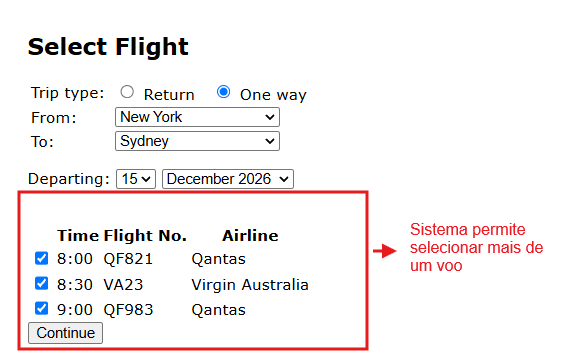

# BUG-FS-06: Sistema deixa marcar mais de um voo ao mesmo tempo numa viagem só de ida

**Status:** Aberto
**Severidade:** Média
**Prioridade:** Low
**Componente:** Flight-Search
**Caso de teste vinculado:** QA-FS10
**Ciclo de execução:** Regressão — Full
**Ambiente:** travel.agileway.net (produção/demo pública)
**Reportado por:** Enzo Coelho
**Data:** 11/09/2026

---

## Resumo
Na listagem de voos, dá pra marcar mais de um checkbox ao mesmo tempo, mesmo sendo uma viagem só de ida.

## Pré-condição
1. Estar logado na aplicação.
2. Estar na página de busca de voos.

## Passos para reproduzir
1. Selecionar o tipo de viagem como "One way".
2. Preencher origem, destino e data de partida válidos.
3. Na listagem de voos, marcar mais de um checkbox ao mesmo tempo.
4. Clicar em Continue.

## Resultado esperado
Deveria só dar pra marcar um voo por vez — seja usando radio button no lugar de checkbox, seja com uma validação que desmarque o anterior quando outro for escolhido.

## Resultado obtido
A interface deixa marcar vários checkboxes ao mesmo tempo pra mesma rota, o que não faz sentido pra uma compra de passagem só de ida.

## Evidência

## Impacto
Não trava o fluxo (dá pra prosseguir mesmo assim), mas é um problema de UI/regra de negócio: não fica claro qual voo realmente vai pro booking se mais de um estiver marcado. Pode gerar confusão pro usuário ou até erro na etapa seguinte se o sistema pegar o voo errado da lista.