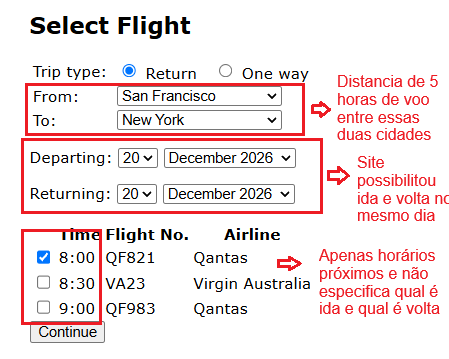

# BUG-FS-07: Voo de ida e volta no mesmo dia (para curta distância) só mostra horários próximos e não separa ida de volta

**Status:** Aberto
**Severidade:** Alta
**Prioridade:** Normal
**Componente:** Flight-Search
**Caso de teste vinculado:** [QA-FS03](../../test-cases/flight-search.md)
**Ciclo de execução:** Regressão — Full
**Ambiente:** travel.agileway.net (produção/demo pública)
**Reportado por:** Enzo Coelho
**Data:** 11/09/2026

---

## Resumo
Quando a data de ida e volta é a mesma, os horários mostrados ficam todos muito próximos um do outro, e a tela não deixa claro qual horário é da ida e qual é da volta — dá pra marcar só um e já ir direto pro booking, pulando a escolha do segundo trecho.

## Pré-condição
1. Estar logado na aplicação.
2. Estar na tela de busca de voos.

## Passos para reproduzir
1. Selecionar o tipo de viagem como "Return".
2. Preencher origem, destino e a mesma data para partida e retorno.
3. Clicar em Continue pra ver os voos.
4. Observar a listagem de horários e tentar escolher a combinação de ida e volta.

## Resultado esperado
sistema deve separar claramente a seleção dos voos de ida e de volta — como em colunas ou etapas distintas —, além de exibir horários compatíveis com a rota e calcular a viabilidade da distância do voo para determinar se o retorno no mesmo dia é logisticamente possível.

## Resultado obtido
Aparecem só horários bem próximos (ex: 8:00, 8:30 e 9:00), sem indicar qual é ida e qual é volta. Dá pra marcar uma única opção e já seguir pro booking e pagamento, sem escolher o segundo trecho da viagem.

## Evidência

## Impacto
São dois problemas juntos: a lógica de geração de horários parece estar errada pra viagens no mesmo dia, e a UI não força o usuário a escolher os dois trechos. Isso pode gerar uma reserva de ida e volta com só um voo de fato marcado, o que não faz sentido pro cliente nem pra operação.