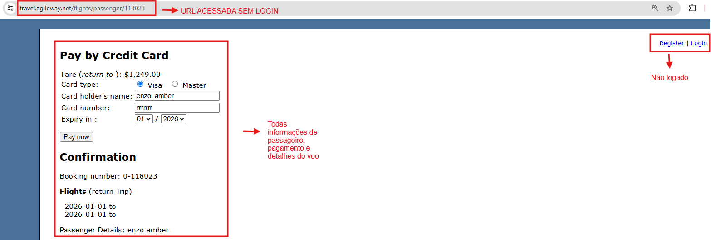

# BUG-PAY-01: Acesso direto via URL a etapas do fluxo de pagamento/passageiro sem validação de sessão

**Status:** Aberto
**Severidade:** Alta
**Prioridade:** High
**Componente:** Payment
**Caso de teste vinculado:** QA-PAY06
**Ciclo de execução:** Regressão — High / Regressão — Full
**Ambiente:** travel.agileway.net (produção/demo pública)
**Reportado por:** Enzo Coelho
**Data:** 11/09/2026

---

## Resumo
O sistema permite acessar diretamente a tela de passageiro/pagamento via URL, sem exigir login ou conclusão das etapas anteriores do fluxo (busca de voo, seleção, booking).

## Passos para reproduzir
1. Limpar a sessão ou abrir uma aba anônima.
2. Inserir diretamente a URL protegida na barra de endereço, por exemplo:
   `https://travel.agileway.net/flights/passenger/118023`
3. Observar que a tela carrega normalmente.

## Resultado esperado
O sistema deve bloquear o acesso e redirecionar obrigatoriamente para a tela de Login (se não autenticado) ou para o início do fluxo de busca de voos (se autenticado, mas sem progresso no fluxo de compra).

## Resultado obtido
O sistema exibe a tela de passageiro/pagamento normalmente, sem qualquer validação de sessão ou de etapas anteriores concluídas.

## Evidência

## Impacto
Falha de controle de acesso. Permite que qualquer pessoa com um ID de reserva ou URL válida acesse a etapa de pagamento sem ter passado pelo fluxo de busca e seleção de voo, exposição de dados de reserva de terceiros.