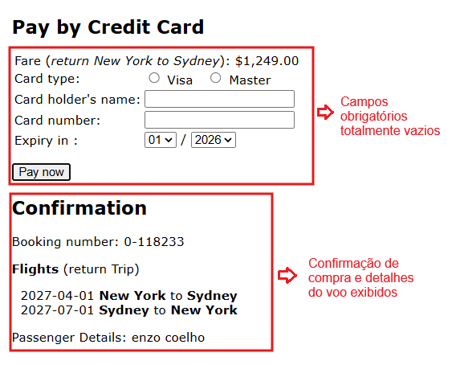

# BUG-PAY-02: Sistema fecha a compra mesmo com todos os campos de pagamento vazios

**Status:** Aberto
**Severidade:** Crítica
**Prioridade:** Normal
**Componente:** Payment
**Caso de teste vinculado:** QA-PAY02
**Ciclo de execução:** Regressão — Full
**Ambiente:** travel.agileway.net (produção/demo pública)
**Reportado por:** Enzo Coelho
**Data:** 11/09/2026

---

## Resumo
Dá pra clicar em `Pay now` sem preencher nada — nem tipo de cartão, nem nome, nem número — e mesmo assim o sistema fecha a compra e gera um número de reserva.

## Pré-condição
1. Estar logado na aplicação.
2. Estar na tela de pagamento por cartão de crédito.

## Passos para reproduzir
1. Deixar `Card type` sem marcar nenhuma opção.
2. Deixar `Card holder's name` e `Card number` completamente vazios.
3. Clicar direto em `Pay now`.
4. Ver o que acontece na tela.

## Resultado esperado
O sistema deveria validar que todos os campos obrigatórios foram preenchidos, mostrar erro nos campos vazios e não deixar a transação seguir.

## Resultado obtido
O sistema ignora que está tudo vazio, processa a operação normalmente e já leva pra tela de confirmação, com número de reserva gerado sem nenhum pagamento real ter sido preenchido.

## Evidência

## Impacto
Falha crítica que gera reservas confirmadas sem nenhum dado de cobrança associado. Isso representa um risco financeiro direto para o negócio, resultando em prejuízos operacionais e em reservas fantasmas que ocupam assentos de forma indevida no sistema.