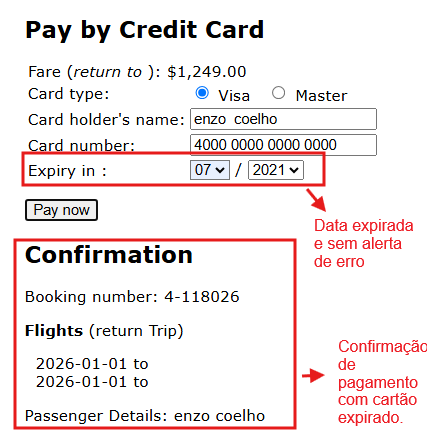

# BUG-PAY-04: Sistema aceita cartão de crédito com data de validade expirada

**Status:** Aberto
**Severidade:** Alta
**Prioridade:** Normal
**Componente:** Payment
**Caso de teste vinculado:** QA-PAY04
**Ciclo de execução:** Regressão — Full
**Ambiente:** travel.agileway.net (produção/demo pública)
**Reportado por:** Enzo Coelho
**Data:** 11/09/2026

---

## Resumo
O sistema permite concluir o pagamento mesmo quando é informada uma data de validade de cartão já vencida, sem exibir nenhum aviso de erro.

## Passos para reproduzir
1. Fazer login com credenciais válidas.
2. Buscar um voo e selecionar uma opção válida.
3. Preencher os dados obrigatórios em Passenger Details e avançar.
4. Na tela de pagamento, preencher:
   - Card type: Visa (ou Master)
   - Card holder's name: enzo coelho
   - Card number: 4000 0000 0000 0000
   - Expiry: 07/2021 (data já vencida)
5. Clicar em `Pay now`.

## Resultado esperado
O sistema deveria comparar a data de validade com a data atual, e se estiver vencida, bloquear o envio e avisar algo tipo "The credit card has expired", mantendo o usuário na tela de pagamento.

## Resultado obtido
O sistema aceita sem nenhum alerta, processa a transação e avança pra tela de Confirmation com número de reserva gerado (ex: Booking number: 4-118026).

## Evidência

## Impacto
O sistema aceitar cartões com data expirada representa uma falha grave na validação de transações. O problema evidencia a ausência de verificações básicas de segurança de pagamento, permitindo a confirmação de reservas com dados incorretos desatualizados.